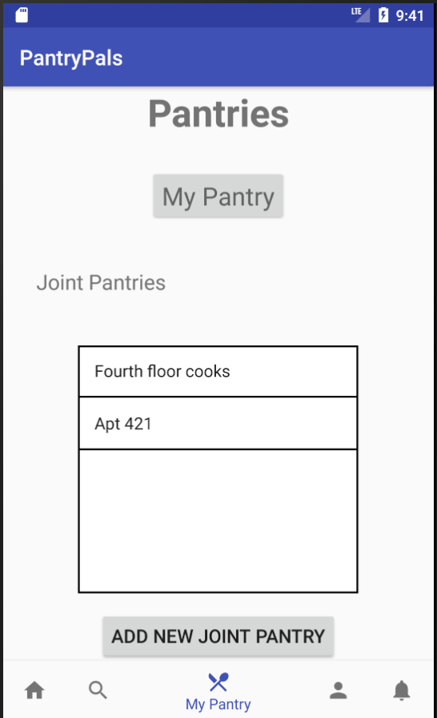
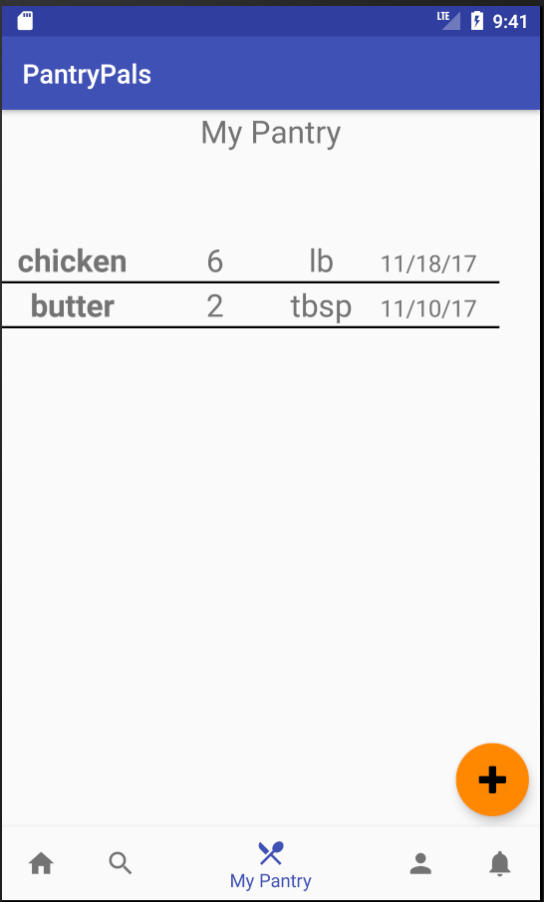
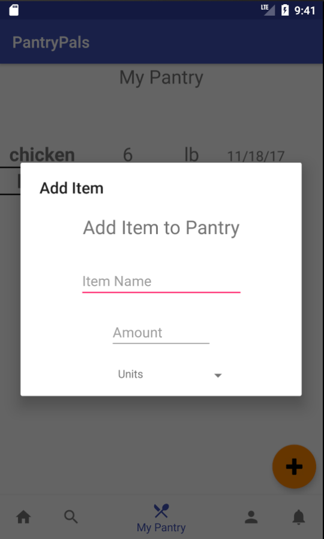
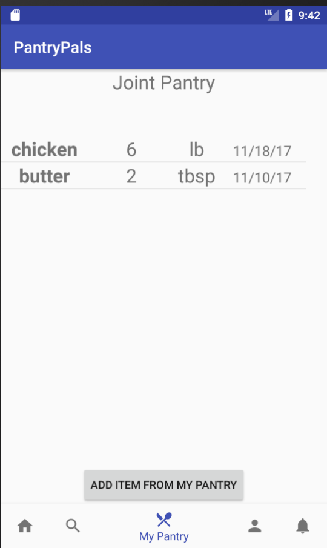
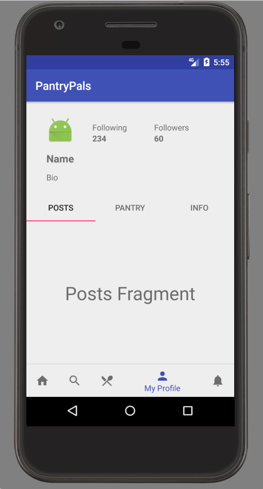
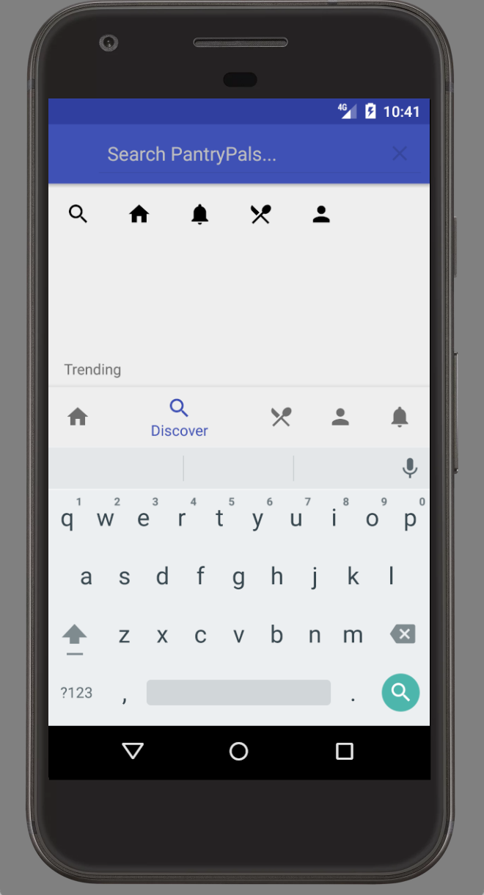
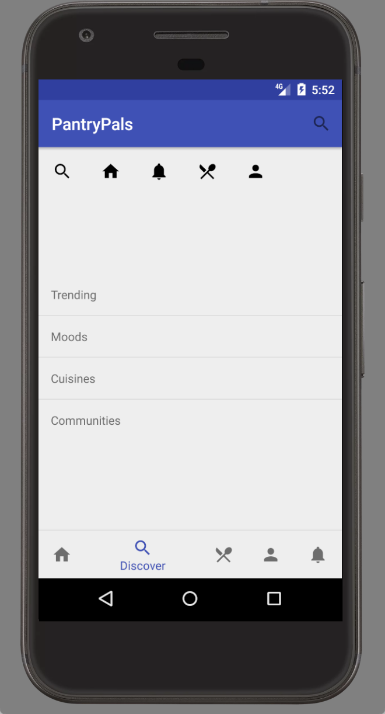
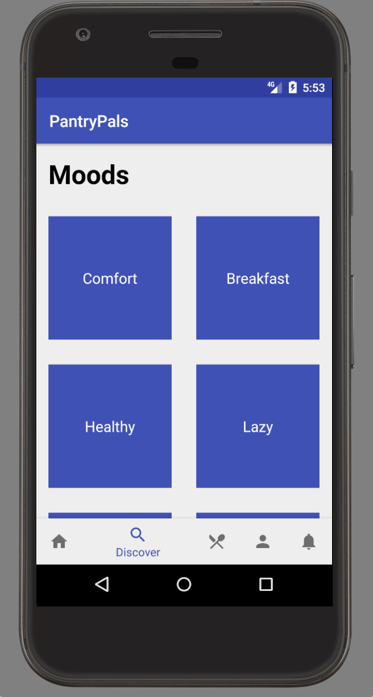
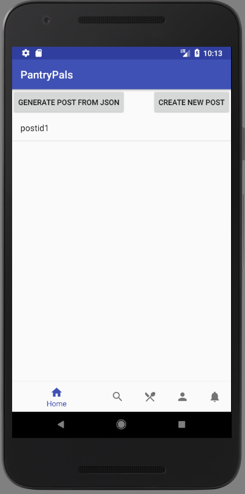

PantryPals - Milestone 2
===================

New Assumptions
--------------
For Milestone 1, we had set up a relational database schema for our Android app, PantryPals. Upon further discussion, we decided that a NoSQL database service may suit our needs better because their built-in APIs that make transmission of data easier and more seamless. We chose Google’s Firebase as our source of truth, Android Studio for IDE, and GitHub for version control. Our decision to go with Firebase was due to the flexibility of NoSQL design as well as several of the perks that Firebase itself offers. These include built in authentication and a real-time database which is essential for our social media app. Because the database is real-time and automatically pushes updates, much of the work of the interactivity between users will be handled already. 


Data Model
--------------
Firebase is a JSON-based NoSQL realtime database. We translated our original relational database schema to a JSON format that could be serialized and de-serialized. This consisted of two steps: 1) Coming up with a sample JSON dummy data, and 2) Creating the “Model” portion of the MVC pattern for building an Android app.

The following diagram shows the dummy dataset created for a post [LINK TO SCREENSHOT]. And the model classes are created so that the Firebase client in Android Studio could read/write data seen in the following links:

- [User](https://github.com/tribby5/PantryPals/blob/master/app/src/main/java/pantrypals/models/User.java)
- [Recipe](https://github.com/tribby5/PantryPals/blob/master/app/src/main/java/pantrypals/models/Recipe.java)
- [Post](https://github.com/tribby5/PantryPals/blob/master/app/src/main/java/pantrypals/models/Post.java)
- [Pantry](https://github.com/tribby5/PantryPals/blob/master/app/src/main/java/pantrypals/models/Pantry.java)
- [Group](https://github.com/tribby5/PantryPals/blob/master/app/src/main/java/pantrypals/models/Group.java)
- [Comment](https://github.com/tribby5/PantryPals/blob/master/app/src/main/java/pantrypals/models/Comment.java)

Read and write to the real-time database works through the Firebase reference in the code. The following examined on Firebase web console shows users’ information written at login with a unique ID generated by Firebase server. [screenshot] The following shows the code that pushes a User instance to the real-time database:
```java
    private void writeNewUser(String userId, String name, String email) {
        User user = new User();
        user.setName(name);
        user.setEmail(email);
        mDatabase.child("userAccounts").child(userId).setValue(user);
    }
```
In a later section of this write-up, we see that the post data has been successfully retrieved in the Feed page.

Features
--------------
#### Completed Features:
Login Page with authentication via Firebase Authentication
Forgot password feature completed
Registration page which sends a confirmation email
Bottom Nav Bar which allows one to traverse the multiple activities of the app
UI for the Pantry Pages
Discover page to find trending items, and explore moods, cuisines, and communities
Profile page with pantry, account info, and posts
Reading and Writing to Firebase database

#### Planned Features:
Integration of our data model and the UI. A lot of the UI has been created and the data model has been created meaning that the next necessary step is the integration of the two into concert with one another
Notifications (similar to Facebook notifications, i.e.when someone comments on your post)
Intelligent feed based on users’ preferences and connections
Messaging feature between users (supported via Firebase). An example use case would be if you wanted to ask someone about a recipe or ask to borrow an ingredient from someone. 
Communities of people as well as the ability to follow other people
My grocery list (i.e. what are you missing from your pantry that you need for this recipe)
A generally more aesthetic design / UI


Platform
--------------
[Firebase](https://firebase.google.com/) is a powerful platform for building iOS, Android, and web-based apps, offering real-time data storage and synchronization, user authentication, and more. The biggest reason we decided to use it as our platform is that it is easy to use and provides features such as authentication, storage, cloud messaging, notifications, and database. These are features commonly found in Android applications and also the ones we are planning on incorporating into our app. Using Firebase can help us bypass a lot of infrastructure work needed to support these features. Additionally, we found the NoSQL design of Firebase to be a more flexible option for extensibility of our application versus the traditional more rigid schema of relational databases. 
We chose to do an Android application because of its widespread popularity and its easy integration with Firebase, given that the two are both Google products. For example, Android Studio has a Firebase Assistant which aids in handling issues and setup of Firebase in an Android app. 

UI Design
--------------
#### Pantries
Home Page: Shows a link to the user’s main pantry and all the possible joint pantries that a user may or may not be a part of. 



If a user selects to see their own pantry, they would see this display of the rows of items that they own. In the future, the contents of this page will be able to be sorted by the different categories. There will also be a basic search functionality implemented as some people’s pantries could theoretically grow to a large size to the point where scrolling would be impractical. The orange add button on the button right of the screen represents the ability to add a new item to the pantry. By clicking on a row/item, a modal for editing or deleting the item and its characterics will appear. 



This represents the add item modal that appears when the orange add button is selected. This lets a user add items to their pantry



This is how a joint pantry will be displayed for a user. It is similar in design to the personal pantry for simplicity but instead of the orange add button which allows one to add a new item to the pantry, the item at the bottom of the pantry is just to allow the users to select items that they already own (are in their pantry) and place them in the group pantry. 


#### Profile
The profile page contains basic information about a user, including their name, bio, the number of followers they have, and the number of people they follow. It also contains three tabs: posts, pantry, and info. The first tab shows recent posts by the user. The second tab shows the user’s pantry. Finally, the third tab shows information about the user, including their dietary restrictions, preferences, joint pantries, and which communities they belong to.


#### Discover
The discover page is the portal through which users can explore more. At the top of the page is a search bar which users can use to search for any keyword throughout the entire app. There are also a list of featured posts that the user can explore, picked by the editors of the app. Finally, there are four additional lists of content: trending, moods, cuisines, and communities. Each of these leads to further pages that help narrow down the search, until the user finds a post they are interested in.



For example, when the user clicks on “Moods”, they are brought to a page showing various kinds of moods. Each of these leads to posts related to the particular mood, which the user can peruse.


#### Feed
Feed is the first page that users will encounter to see what relevant and new articles are posted including posts and recipes. Currently this page is displaying one element, which is in fact read from the real-time database. It also supports scrolling update, similar to that of Facebook news feed. Recipe and Post Generators will be used initially to populate the real-time database with more posts so that we could see the scrolling feed.

The data retrieval from real-time database and scrolling ListView is supported by the following code snippet: 
```java
        ref.limitToFirst(10).addValueEventListener(new ValueEventListener() {
            @Override
            public void onDataChange(DataSnapshot dataSnapshot) {
                for (DataSnapshot snapshot : dataSnapshot.getChildren()) {
                    oldestPostId = snapshot.getKey();

                    dataSnapshot.getChildrenCount();
                    Post post = snapshot.getValue(Post.class);
                    String postId = snapshot.getKey();
                    feedList.add(post);
```


Source Code
--------------
#### GitHub Repository Link
Our publicly available repository can be found [here](https://github.com/tribby5/PantryPals). This repository contains code implementing a simple but working-database driven Android app on Firebase.

#### Generating and loading a dataset
Our dataset equivalent is real-life recipe and post data. If we want to insert a lot of recipes, that means that we would have to log in as a user and manually insert hundreds of recipes by hand. Since this is unrealistic, Generator scripts were written so that the app can read JSON files and parse them into Recipe and Post instances, which could in turn be sent to the real-time database. Here is a link to [RecipeGenerator.java](https://github.com/tribby5/PantryPals/blob/master/app/src/main/java/pantrypals/datagenerator/RecipeGenerator.java), which has a sample JSON string included to demonstrate that it can turn it into a Model object.
Additionally, [this](https://api.myjson.com/bins/9435z) is a sample JSON data that may be fed into a Generator.


Members
--------------
**Matthew Tribby**: Set up and linked the Firebase database with the application, basic authentication through Firebase, login and registration page, and UI for the Pantry Pages 

**Aditya Srinivasan**: Worked on UI and functionality for Discover and Profile pages

**Hunter Lee**: Implemented duplication with Firebase authentication and the real-time database, created the data model in order to enable read and write with the database, designed the UI for main feed page, implemented scrolling ListView for scroll-loading, wrote Generator scripts that read from JSON and create pre-serialized Java objects for inputting data into database.

**Alison Huang**: Created bottom navigation bar and structure of fragments

**Anika Ayyar**: Participated in group design meeting

**Luke Farrell**: Participated in group design meeting

**Miles Turpin**: Participated in group design meeting, developing UI and functionality for Post page.